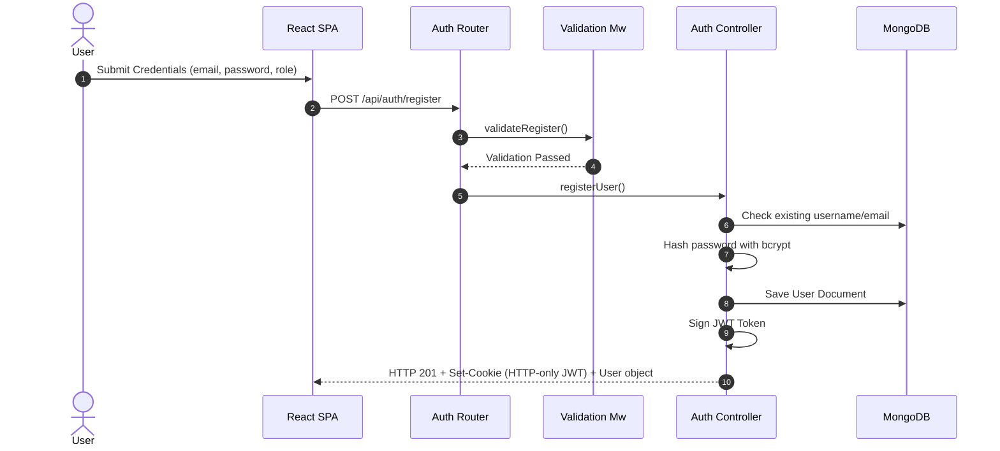
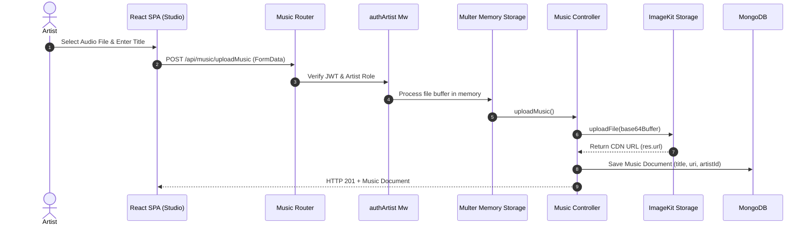
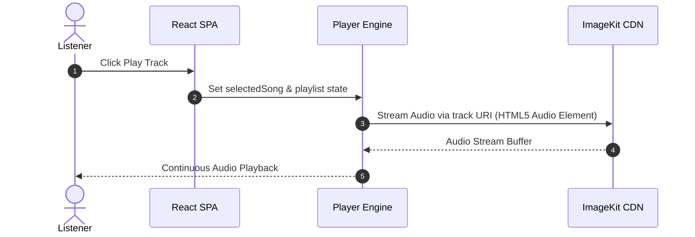

# High-Level Design (HLD)

## 1. System Architecture Overview

Soundscape is structured using a client-server architectural pattern. The system consists of a Single Page Application (SPA) frontend built with React and Vite, a Node.js/Express REST API backend, a MongoDB document database for persistent data, and ImageKit Cloud Object Storage for hosting media files.

```mermaid
flowchart TD
    subgraph Client ["Client Layer (Browser)"]
        SPA["React 19 SPA (Vite)"]
        Player["Persistent Audio Engine"]
    end

    subgraph Backend ["Application Layer (Node.js & Express 5)"]
        Router["Express App & Routers"]
        AuthMw["Auth Middleware (JWT Validation)"]
        ValMw["Validation Middleware"]
        AuthCtrl["Auth Controller"]
        MusicCtrl["Music Controller"]
        StorageSvc["Storage Service (ImageKit SDK)"]
    end

    subgraph Storage ["Data & Storage Layer"]
        MongoDB[("MongoDB Database (Mongoose)")]
        ImageKit Cloud["ImageKit CDN / Media Cloud"]
    end

    %% Client to Backend
    SPA -->|HTTP Requests / Cookies| Router
    Player -->|Audio Stream Request| ImageKit Cloud

    %% Backend internal processing
    Router --> ValMw
    ValMw --> AuthMw
    AuthMw --> AuthCtrl
    AuthMw --> MusicCtrl
    MusicCtrl --> StorageSvc

    %% Backend to Data Layer
    AuthCtrl -->|User CRUD| MongoDB
    MusicCtrl -->|Music & Album Metadata| MongoDB
    StorageSvc -->|Binary Audio Upload| ImageKit Cloud
```

---

## 2. Component Subsystems

### 2.1 Web Client (Frontend Subsystem)
* **Framework**: React 19 bootstrapped with Vite 8.
* **Responsibilities**:
  * Render responsive UI components (Header, Sidebar, Track Lists, Album View, Artist Studio).
  * Manage active user session via state and `localStorage`.
  * Maintain continuous, non-blocking HTML5 audio streaming via persistent `Player` component.
  * Issue asynchronous HTTP API calls using `client/src/api.js`.

### 2.2 API Gateway & Express App (Backend Subsystem)
* **Runtime & Framework**: Node.js with Express 5.
* **Responsibilities**:
  * Serve static frontend assets from `client/dist`.
  * Route API requests to `/api/auth` and `/api/music` sub-routers.
  * Parse incoming JSON payloads and HTTP cookie headers (`cookie-parser`).
  * Process multipart form uploads in memory using `multer`.

### 2.3 Middleware Engine
* **Authentication Middleware**:
  * `authArtist`: Verifies valid JWT token in cookies and checks for `role === 'artist'`.
  * `authUser`: Verifies valid JWT token in cookies for any authenticated role (`user` or `artist`).
* **Validation Middleware**:
  * Validates request formats, email regex patterns, password lengths, and MongoDB ObjectId parameters before hitting controllers.

### 2.4 Cloud Media Storage Subsystem
* **Service**: ImageKit Cloud Object Storage.
* **Integration**: Managed via `@imagekit/nodejs` SDK inside `Services/storage.service.js`.
* **Flow**: Audio buffers received via Multer memory storage are uploaded to the `spotify-clone/music` folder on ImageKit, producing public HTTPS CDN URLs.

### 2.5 Database Subsystem
* **Database**: MongoDB instance connected via Mongoose ODM.
* **Data Collections**:
  * `users`: Account identities and hashed credentials.
  * `musics`: Music metadata and cloud storage audio URIs.
  * `albums`: Album collections containing references to `musics` documents and `artist` user documents.

---

## 3. Data Flow Diagrams

### 3.1 User Registration & Login Flow



### 3.2 Music Upload Flow (Artist Role)



### 3.3 Audio Playback & Streaming Flow



---

## 4. Security & Access Control Model

```
+-------------------------------------------------------------------+
|                        Client Request                             |
+-------------------------------------------------------------------+
                                  |
                                  v
+-------------------------------------------------------------------+
|               Cookie Parser (Extract JWT Cookie)                  |
+-------------------------------------------------------------------+
                                  |
                                  v
+-------------------------------------------------------------------+
|            JWT Verification (Verify Secret & Payload)             |
+-------------------------------------------------------------------+
             /                                         \
            /                                           \
           v                                             v
+-----------------------+                     +-----------------------+
|  Role Check: Artist   |                     |   Role Check: User    |
| (authArtist Middleware)|                     | (authUser Middleware) |
+-----------------------+                     +-----------------------+
           |                                             |
   (upload, createAlbum)                        (allMusic, albums)
```

---

## 5. Deployment Topology

* **Application Server**: Node.js standard process (Port 3000).
* **Database**: Remote MongoDB instance initialized via `MONGO_STRING` URI.
* **Storage Cloud**: ImageKit API authenticated via `PRIVATE_KEY`.
* **Static Assets**: Express static middleware serving compiled React distribution from `client/dist`.
