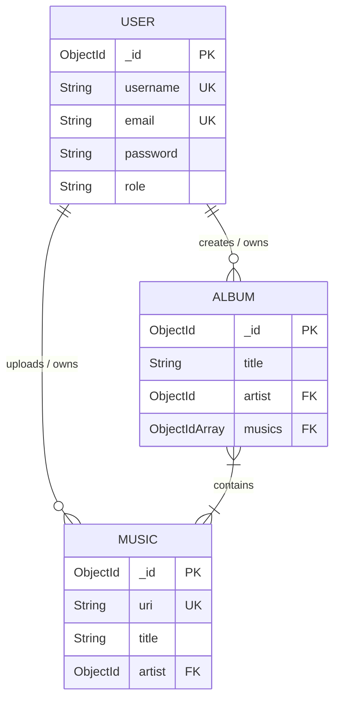

# Low-Level Design (LLD)

## 1. Data Models & Database Schema

The database relies on MongoDB with Mongoose object relational modeling.

### 1.1 User Schema (`Model/user.model.js`)
Stores system user profiles, auth credentials, and operational roles.

```javascript
const userSchema = new mongoose.Schema({
  username: {
    type: String,
    unique: true,
    required: true
  },
  email: {
    type: String,
    unique: true,
    required: true
  },
  password: {
    type: String,
    required: true
  },
  role: {
    type: String,
    enum: ["user", "artist"],
    default: "user"
  }
});
```

### 1.2 Music Schema (`Model/music.model.js`)
Stores metadata for individual audio tracks uploaded to ImageKit CDN.

```javascript
const musicSchema = new mongoose.Schema({
  uri: {
    type: String,
    required: true,
    unique: true
  },
  title: {
    type: String,
    required: true
  },
  artist: {
    type: mongoose.Schema.Types.ObjectId,
    ref: "user",
    required: true
  }
});
```

### 1.3 Album Schema (`Model/album.model.js`)
Groups multiple music tracks into an album structure curated by an artist.

```javascript
const albumSchema = new mongoose.Schema({
  title: {
    type: String,
    required: true
  },
  musics: [{
    type: mongoose.Schema.Types.ObjectId,
    ref: "music"
  }],
  artist: {
    type: mongoose.Schema.Types.ObjectId,
    ref: "user",
    required: true
  }
});
```

### 1.4 Entity Relationship Diagram (ERD)



---

## 2. Detailed API Specifications

### 2.1 Authentication Module (`/api/auth`)

#### `POST /api/auth/register`
* **Middleware**: `validateRegister`
* **Request Body**:
  ```json
  {
    "username": "artist_jane",
    "email": "jane@example.com",
    "password": "securepassword123",
    "role": "artist"
  }
  ```
* **Validation Rules**:
  * `username`: string, min length 3.
  * `email`: valid regex pattern (`/^[^\s@]+@[^\s@]+\.[^\s@]+$/`).
  * `password`: string, min length 8.
  * `role`: optional, string matching `"user"` or `"artist"`.
* **Responses**:
  * `201 Created`: Set HTTP-only `token` cookie.
    ```json
    {
      "message": "User is registered successfully ",
      "user": {
        "id": "64f1a2b3c4d5e6f7a8b9c0d1",
        "username": "artist_jane",
        "email": "jane@example.com",
        "role": "artist"
      }
    }
    ```
  * `400 Bad Request`: Validation failure message and array of errors.
  * `409 Conflict`: Username or Email already registered.

#### `POST /api/auth/login`
* **Middleware**: `validateLogin`
* **Request Body**:
  ```json
  {
    "username": "artist_jane",
    "password": "securepassword123"
  }
  ```
* **Responses**:
  * `200 OK`: Set HTTP-only `token` cookie.
    ```json
    {
      "message": "Login Successful ",
      "id": "64f1a2b3c4d5e6f7a8b9c0d1",
      "user": "artist_jane",
      "emial": "jane@example.com",
      "role": "artist"
    }
    ```
  * `401 Unauthorized`: Invalid credentials.

#### `POST /api/auth/logout`
* **Responses**:
  * `200 OK`: Clears `token` cookie.
    ```json
    {
      "message": "User logout successfully "
    }
    ```

---

### 2.2 Music & Album Module (`/api/music`)

#### `POST /api/music/uploadMusic`
* **Access**: Authenticated `artist` (`authArtist` middleware).
* **Content-Type**: `multipart/form-data`
* **Form Fields**:
  * `title`: string (Required)
  * `music`: file binary (Required)
* **Processing Flow**:
  1. Multer processes audio file into `req.file.buffer`.
  2. `uploadFile(file.buffer.toString("base64"))` uploads to ImageKit.
  3. Mongoose creates `music` entry with `uri` set to ImageKit URL.
* **Response `201 Created`**:
  ```json
  {
    "message": "Music is created successfully",
    "music": {
      "id": "64f1a2b3c4d5e6f7a8b9c0d2",
      "uri": "https://ik.imagekit.io/.../music12345.mp3",
      "title": "Midnight City",
      "artist": "64f1a2b3c4d5e6f7a8b9c0d1"
    }
  }
  ```

#### `POST /api/music/createAlbum`
* **Access**: Authenticated `artist` (`authArtist` middleware).
* **Request Body**:
  ```json
  {
    "title": "Neon Lights Album",
    "musics": ["64f1a2b3c4d5e6f7a8b9c0d2", "64f1a2b3c4d5e6f7a8b9c0d3"]
  }
  ```
* **Validation**:
  * `title`: non-empty string.
  * `musics`: non-empty array of valid MongoDB ObjectIds.
* **Response `201 Created`**:
  ```json
  {
    "message": "Album is created successfully",
    "album": {
      "id": "64f1a2b3c4d5e6f7a8b9c0d4",
      "title": "Neon Lights Album",
      "artist": "64f1a2b3c4d5e6f7a8b9c0d1",
      "musics": ["64f1a2b3c4d5e6f7a8b9c0d2", "64f1a2b3c4d5e6f7a8b9c0d3"]
    }
  }
  ```

#### `GET /api/music/allMusic`
* **Access**: Authenticated (`authUser` middleware).
* **Query Behavior**: Returns list of music documents with populated `artist` (`username`, `email`).
* **Response `200 OK`**:
  ```json
  {
    "message": "Music fetched successfully",
    "music": [
      {
        "_id": "64f1a2b3c4d5e6f7a8b9c0d2",
        "title": "Midnight City",
        "uri": "https://ik.imagekit.io/.../music12345.mp3",
        "artist": {
          "_id": "64f1a2b3c4d5e6f7a8b9c0d1",
          "username": "artist_jane",
          "email": "jane@example.com"
        }
      }
    ]
  }
  ```

#### `GET /api/music/albums`
* **Access**: Authenticated (`authUser` middleware).
* **Response `200 OK`**: Returns albums with title, populated artist details.

#### `GET /api/music/albums/:albumId`
* **Access**: Authenticated (`authUser` middleware).
* **Url Params**: `albumId` (must be valid MongoDB ObjectId via `validateAlbumId`).
* **Response `200 OK`**: Album document fully populated with `artist` and array of `musics` track objects.

---

## 3. Middleware & Storage Services

### 3.1 Authentication Middleware (`Middleware/auth.middleware.js`)
* Extract JWT token from `req.cookies.token`.
* Execute `jwt.verify(token, process.env.JWT_SECRET)`.
* `authArtist`: Validates `decoded.role === "artist"`. Returns `403 Forbidden` if role requirement fails.
* `authUser`: Validates `decoded.role === "user" || decoded.role === "artist"`.
* Attach `req.user = decoded` for downstream controllers.

### 3.2 Storage Service (`Services/storage.service.js`)
```javascript
const { ImageKit } = require("@imagekit/nodejs");
const imageKitClient = new ImageKit({
  privateKey: process.env.PRIVATE_KEY
});

async function uploadFile(file) {
  return await imageKitClient.files.upload({
    file, // Base64 buffer string
    fileName: "music" + Date.now(),
    folder: "spotify-clone/music"
  });
}
```

---

## 4. Frontend Component Hierarchy & State Architecture

```
[ App.jsx ]
  ├── [ Sidebar.jsx ]      (Navigation & view state selection)
  ├── [ Header.jsx ]       (User profile state & logout trigger)
  ├── [ View Component ]
  │     ├── [ Auth.jsx ]         (Login/Register view)
  │     ├── [ HeroSection ]      (Welcome hero block)
  │     ├── [ SongList.jsx ]     (Display & play music tracks)
  │     ├── [ AlbumList.jsx ]    (Display album list)
  │     ├── [ AlbumDetail.jsx ]  (Display album tracks)
  │     └── [ ArtistStudio.jsx ] (Track upload & album creation forms)
  └── [ Player.jsx ]       (Global persistent audio playback engine)
```
